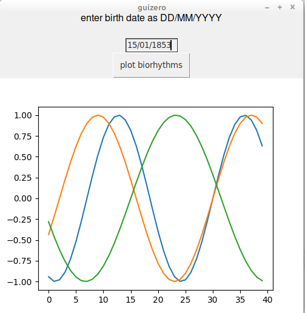

# Biorhythms using guizero and matplotlib

NB: Biorhythms are **PseudoScience** (but fun).

See the [Wikipedia article](https://en.wikipedia.org/wiki/Biorhythm_(pseudoscience))

Here's what it does:

To run it, clone the repository, install guizero and matplotlib, and run `python3 biorhythms.gui`

If anyone is interested I'll package it on PyPi.